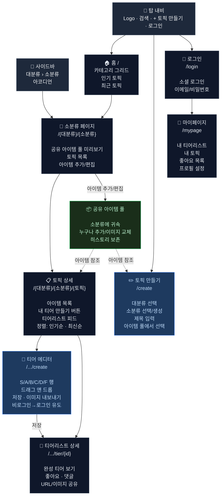
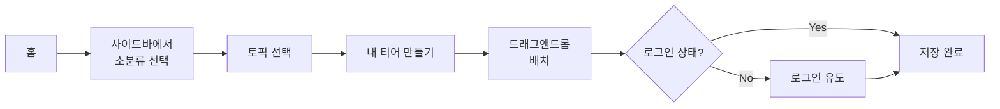
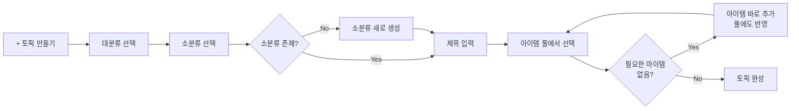
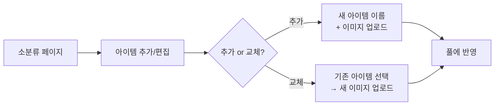
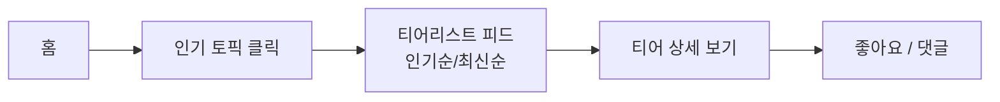
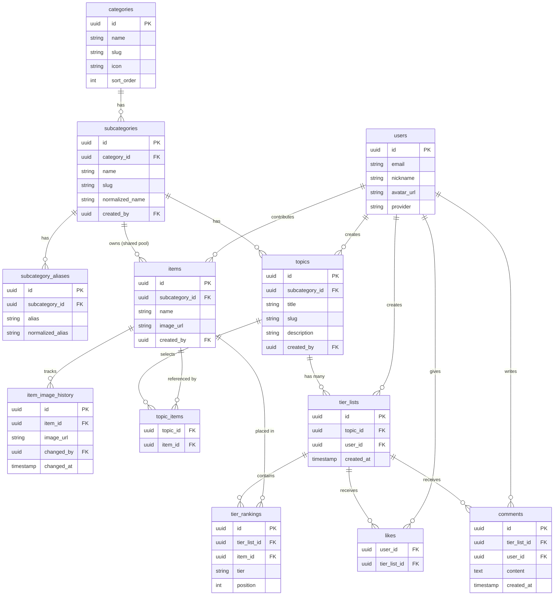

# Information Architecture - Tier Maker

## 1. 콘텐츠 계층 구조

```
대분류 카테고리 (관리자 고정)
│   예: 만화/애니, 게임, 영화, 음식, 스포츠, 음악
│
└── 소분류 카테고리 (사용자 생성)
    │   예: 원피스, 나루토, 귀멸의 칼날
    │   - 별칭 지원 (원피스 = ONE PIECE = onepiece)
    │   - 정규화 매칭으로 중복 방지
    │   - 토픽 생성 시 함께 생성 가능
    │
    ├── 📦 공유 아이템 풀
    │   │   예: 루피, 조로, 나미, 상디... (200명)
    │   │   - 로그인 사용자 누구나 추가/이미지 교체 가능
    │   │   - 이미지 변경 히스토리 보존
    │   │
    │   └── (아이템은 소분류에 귀속, 토픽에서 참조)
    │
    └── 토픽 (사용자 생성)
        │   예: "밀짚모자 해적단 전투력 순위"
        │   - 공유 아이템 풀에서 원하는 아이템을 선택하여 구성
        │   - 풀에 없는 아이템은 토픽 생성 중 바로 추가 가능 (풀에도 반영)
        │
        └── 티어리스트 (개인 생성)
                예: 김철수의 밀짚모자 전투력 티어
                - 토픽의 아이템을 S/A/B/C/D/F에 드래그앤드롭 배치
                - 한 토픽에 여러 사용자의 티어리스트가 쌓임
```

## 2. 글로벌 레이아웃

```
┌─────────────────────────────────────────────────────────┐
│  Logo        │  🔍 검색...              │ [+ 토픽 만들기] [로그인] │
├──────────────┼──────────────────────────────────────────┤
│  사이드바      │                                          │
│              │  메인 콘텐츠 영역                           │
│  만화/애니 ▾  │                                          │
│    원피스     │                                          │
│    나루토     │                                          │
│  게임 ▾      │                                          │
│    LoL       │                                          │
│    발로란트   │                                          │
│  영화 ▾      │                                          │
│  음식 ▾      │                                          │
│  ...         │                                          │
└──────────────┴──────────────────────────────────────────┘
```

- **탑 내비**: 로고(좌), 검색창(중앙), 토픽 만들기 + 로그인(우)
- **사이드바**: 대분류 > 소분류 아코디언. 항상 노출
- **메인 콘텐츠**: 현재 페이지에 따라 변경

## 3. 페이지 구조 & URL

### 홈
- **URL**: `/`
- **내용**: 카테고리 그리드 + 인기 토픽 + 최근 생성 토픽
- **목적**: 카테고리 탐색 진입점

### 소분류 페이지
- **URL**: `/{대분류}/{소분류}` (예: `/manga/one-piece`)
- **내용**:
  - 공유 아이템 풀 미리보기
  - 소속 토픽 목록 (인기순/최신순 정렬)
  - [토픽 만들기] 버튼
  - [아이템 추가/편집] 버튼 (로그인 시)

### 토픽 상세 페이지
- **URL**: `/{대분류}/{소분류}/{토픽-slug}`
- **내용**:
  - 토픽 제목 & 설명
  - 아이템 목록 (이 토픽에 선택된 아이템들)
  - [내 티어 만들기] 버튼
  - 다른 사람들의 티어리스트 피드 (인기순 기본, 최신순 전환)
    - 각 티어리스트 미리보기 (축약된 S/A/B/C 배치)
    - 좋아요 수, 작성자, 작성 시간

### 티어 만들기 (에디터)
- **URL**: `/{대분류}/{소분류}/{토픽-slug}/create`
- **내용**:
  - S/A/B/C/D/F 티어 행 (추가/삭제/이름 변경/색상 변경 가능)
  - 미배치 아이템 영역
  - 드래그 앤 드롭으로 배치
  - [저장] → 비로그인 시 로그인 유도
  - [이미지로 내보내기]

### 티어리스트 상세 페이지
- **URL**: `/{대분류}/{소분류}/{토픽-slug}/tier/{tier-id}`
- **내용**:
  - 완성된 티어 배치 보기
  - 작성자 정보
  - 좋아요, 댓글
  - 공유 (URL, 이미지 다운로드)

### 토픽 만들기
- **URL**: `/create`
- **내용**:
  - 대분류 선택
  - 소분류 선택 (검색 가능 드롭다운, 없으면 새로 생성)
  - 토픽 제목 입력
  - 공유 아이템 풀에서 아이템 선택 (체크박스)
  - 풀에 없는 아이템 바로 추가

### 마이페이지
- **URL**: `/mypage`
- **내용**:
  - 내 티어리스트 목록
  - 내가 만든 토픽 목록
  - 좋아요한 티어리스트
  - 프로필 설정

### 로그인/회원가입
- **URL**: `/login`, `/signup`
- **내용**: 소셜 로그인 (Google, GitHub 등) + 이메일/비밀번호

## 4. 사용자 권한 모델

| 기능 | 비로그인 | 로그인 |
|------|:-------:|:-----:|
| 카테고리/토픽 탐색 & 검색 | O | O |
| 다른 사람 티어리스트 보기 | O | O |
| 티어 만들기 (체험) | O | O |
| 티어 저장 & 공유 | X → 로그인 유도 | O |
| 토픽 만들기 | X | O |
| 소분류 생성 (토픽 생성 시) | X | O |
| 아이템 추가 | X | O |
| 아이템 이미지 교체 | X | O |
| 좋아요 / 댓글 | X | O |
| 마이페이지 | X | O |

## 5. 데이터 관계도

```
categories (대분류)
│   id, name, slug, icon, sort_order
│   관리자 고정
│
└── subcategories (소분류)
    │   id, category_id, name, slug, normalized_name
    │   사용자 생성, 별칭 테이블 연결
    │
    ├── subcategory_aliases (별칭)
    │       id, subcategory_id, alias, normalized_alias
    │
    ├── items (공유 아이템 풀)
    │   │   id, subcategory_id, name, image_url, created_by
    │   │
    │   └── item_image_history (이미지 변경 히스토리)
    │           id, item_id, image_url, changed_by, changed_at
    │
    └── topics (토픽)
        │   id, subcategory_id, title, slug, description, created_by
        │
        ├── topic_items (토픽-아이템 연결, 풀에서 선택)
        │       topic_id, item_id
        │
        └── tier_lists (티어리스트)
            │   id, topic_id, user_id, created_at
            │
            ├── tier_rankings (배치 정보)
            │       tier_list_id, item_id, tier (S/A/B/C/D/F), position
            │
            ├── likes
            │       user_id, tier_list_id
            │
            └── comments
                    id, tier_list_id, user_id, content, created_at

users
    id, email, nickname, avatar_url, provider
```

## 6. 사이트맵 (Mermaid)



## 7. 핵심 사용자 흐름 (Mermaid)

### 흐름 1: 기존 토픽으로 티어 만들기



### 흐름 2: 새 토픽 만들기



### 흐름 3: 아이템 기여



### 흐름 4: 다른 사람 티어 탐색



## 8. 데이터 관계도 (Mermaid ERD)


